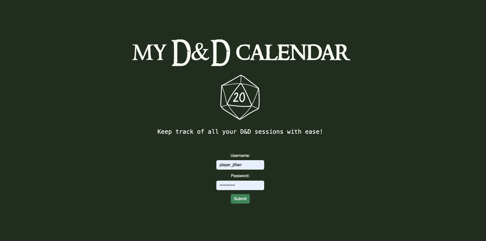

# D&D Calendar

A modular web application for organizing Dungeons & Dragons campaigns. This app provides a custom calendar, session planning tools, RSVP tracking, player availability management, and interactive character and dice microservices — all built using modern web technologies and lightweight Python services.

---

## Project Overview

The D&D Calendar App helps Dungeon Masters and players coordinate campaigns, manage session logistics, and stay organized. The platform supports:

- A full-featured fantasy calendar with custom session scheduling
- Player RSVPs and availability management
- DM-only controls for creating or editing sessions
- A Flask-based character sheet API for storing player stats
- A ZeroMQ-based microservice for secure, server-side dice rolling

Designed using React for the frontend and lightweight Python microservices on the backend, the app enables real-time decision-making and persistent session data — all while preserving a D&D-themed interface and experience.

---

## Tech Stack

### Frontend

- **React** with Hooks (`useState`, `useEffect`)
- **React Router DOM** – SPA navigation
- **React Bootstrap** – Layout and UI components
- **FullCalendar** – Session and timeline display
- **localStorage** – Persistent storage for events, availability, RSVPs
- **Custom styling** – via `App.css` and `d20.png`

### Backend Microservices

- **Microservice 1: Character Sheet API**
  - Built with **Flask**
  - REST API to manage player character data
  - CORS enabled for frontend integration
  - Role-based logic for DMs and Players
  - Runs on `http://localhost:5007`

- **Microservice 2: Dice Roller**
  - Built with **Python and ZeroMQ**
  - Listens on `tcp://127.0.0.1:5555`
  - Responds to JSON requests with secure, server-side dice rolls
  - Supports d4, d6, d8, d10, d12, d20

---

## Features

### Calendar + Session Scheduling

- View all upcoming and past sessions by month
- DMs can add sessions with a date, time, and description
- Players see read-only sessions and can RSVP
- Admin editing only enabled for `dm_cullen`

### Character Sheet Microservice (Flask)

- Player (`player_jillian`) can create and update a character
- DM (`dm_cullen`) can delete player characters
- Fields include:
  - name, race, class, level, attributes (STR, DEX, CON, INT, WIS, CHA), HP, inventory

### Dice Roller Microservice (ZeroMQ)

- Supports rolling `d4`, `d6`, `d8`, `d10`, `d12`, and `d20`
- Frontend sends `{"dice": "d20"}` to socket, receives roll result
- Ensures rolls are randomized and secure from client manipulation

### Player Availability

- Players can define weekly availability (start/end times for each weekday)
- Used by DM to schedule future sessions
- Stored locally per user

### RSVP System

- Players can RSVP “Yes”, “No”, or “Maybe” to each session
- Can include comments in RSVP
- DMs can view all RSVP statuses
